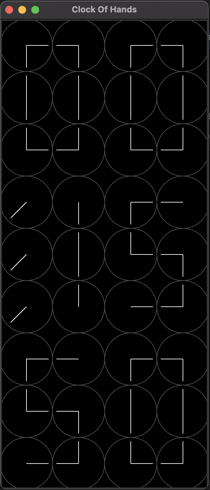

# Clock Of Hands

This project is a graphical clock implemented using Python and Tkinter. The clock displays the current time using a grid of hands that point to different positions to represent digits.

## Project Structure

- `Grid.py`: Contains the `Grid` class which manages the grid of `GridElement` objects and their hand positions.
- `GridElement.py`: Contains the `GridElement` class which represents each element in the grid and manages the drawing and updating of the hands.
- `HandPositions.py`: Contains the `HandPositions` class which defines various hand positions used to represent digits.
- `main.py`: The main entry point of the application. It initializes the Tkinter window, creates the grid, and starts the update loop.

## How to Run

1. Make sure you have Python installed on your system.
2. Install the Tkinter library if you don't have it already.
3. Run the `main.py` script:

```sh
python main.py
```

## How It Works

The clock is composed of a grid of `GridElement` objects, each representing a segment of a digit. The hands of each `GridElement` can point in different directions to form the shape of a digit. The `Grid` class manages the layout of these elements and updates their positions based on the current time.

## Customization

You can customize the appearance and behavior of the clock by modifying the following parameters in the `Grid` class:

- `rows` and `cols`: The number of rows and columns in the grid.
- `rad`: The radius of each `GridElement`.
- `width` and `height`: The width and height of the canvas.
- `digit_grid_width` and `digit_grid_height`: The dimensions of the grid used to display each digit.

You can also modify the hand positions in the `HandPositions` class to change the way digits are represented.


## Screenshot 



12:15:50 am as displayed by the clock


## License

This project is licensed under the MIT License.